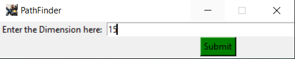

# **PathFinder_2020** : _Astar Algo_

A python game that uses Astar alogorithm to find the shortest path between source and destination, avoiding all the obstracles.

### About the Algorithm:
Astar algorithm is considered to be a _smart algorithm_ as it predicts the shortest path in each step, to find the acutal Shortest path.
* Works by using the sum _F(n)_.
* **_F(n)=G(n)+H(n)_**
  * Cost from the start node to the current node _G(n)_
  * Estimated cost from current node to goal _H(n)_.
 

### Working:
  
* **Choose How big you want the Grid to be.**

  

  
  

  
* **Choose Source and Destination and also the Blockages.**

  

  
  

  
* **Press Confrim then Show Path. The shortest Path gets Highlighted in yellow.**

  

  
  

  
  
### Future:

  * Interating more Algorithms in the Project.
  * Making the UI mordern.
